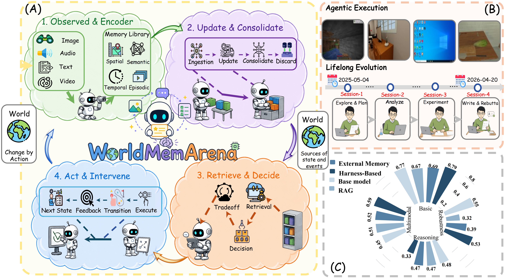
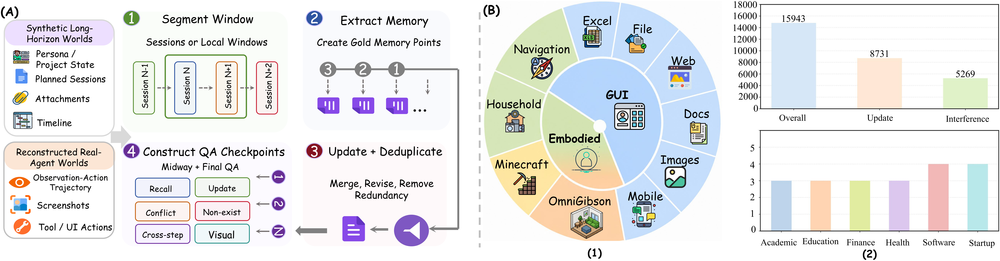

<div align="center">


# WorldMemArena: Evaluating Multimodal Agent Memory Through Action–World Interaction

</div>

<div align="center">

[](http://arxiv.org/abs/2605.29341)
[](https://worldmemarena-mem.github.io/)
[](https://huggingface.co/datasets/LCZZZZ/WorldMemArena)
[](LICENSE)

</div>

A unified evaluation framework for benchmarking **lifelong memory** systems on the [WorldMemArena](https://huggingface.co/datasets/LCZZZZ/WorldMemArena) dataset. Supports **19 baselines** spanning retrieval-augmented memory, embedding-based memory, long-context VLMs, terminal-agent harnesses, and base-model answering paradigms.

<p align="center">
  
</p>

---

## 🚀 Quick Start

```bash
# 0. Clone and enter the project
git clone https://github.com/eric-ai-lab/WorldMemArena.git
cd WorldMemArena

# 1. Install dependencies
pip install -r requirements.txt

# 2. Configure API keys
cp .env.example .env       # then edit .env with your keys (gitignored)

# 3. Download the dataset (one-time, ~10 GB)
huggingface-cli download LCZZZZ/WorldMemArena --repo-type dataset \
  --local-dir ./WorldMemArena

# 4. Run a baseline on the 150-sample subset
python -m eval_framework.cli \
  --dataset ./WorldMemArena \
  --split small \
  --baseline SimpleMem \
  --output-dir ./exp_results
```

---

## 📦 Dataset

<p align="center">
  
</p>

Two evaluation splits are supported via `--split`:

| Flag | Use case |
|------|----------|
| `all` | Full benchmark |
| `small` | Balanced subset for fast iteration |

**Download** ([WorldMemArena](https://huggingface.co/datasets/LCZZZZ/WorldMemArena)):

```bash
huggingface-cli download LCZZZZ/WorldMemArena --repo-type dataset \
  --local-dir ./WorldMemArena
```

or in Python:

```python
from huggingface_hub import snapshot_download
snapshot_download("LCZZZZ/WorldMemArena", repo_type="dataset",
                  local_dir="./WorldMemArena")
```
---

## 📊 Baselines

### Memory Baselines (11)

| # | Baseline | Type | Embedding | GPU |
|---|----------|------|-----------|-----|
| 1 | A-Mem | Agentic + ChromaDB | `text-embedding-3-small` | No |
| 2 | MGMemory | Mem-Gallery text | `text-embedding-3-small` | No |
| 3 | SimpleMem | LanceDB hybrid | `text-embedding-3-small` | No |
| 4 | Omni-SimpleMem | Multimodal FAISS | `text-embedding-3-small` | No |
| 5 | M2A | Milvus Lite | `text-embedding-3-small` | No |
| 6 | ViLoMem | Dual-stream logic+visual | `text-embedding-3-small` | No |
| 7 | MIRIX | LLM-driven agents | None (pure LLM) | No |
| 8 | AUGUSTUSMemory | Multimodal GME | vLLM GME `:8014` | **Yes** |
| 9 | Qwen3-VL-Embedding-8B | VL embedding | vLLM Qwen3-VL-Embed `:8013` | **Yes** |
| 10 | UniversalRAGMemory | Multimodal GME RAG | vLLM GME `:8014` | **Yes** |
| 11 | MMFU_Single | Long-context window | GPT-2 tokenizer (bundled) | No |

### Harness Baselines (3)

| # | Baseline | Agent | Default Model |
|---|----------|-------|---------------|
| 1 | OpenClaw-GPT | OpenClaw CLI | `gpt-5.4-nano` |
| 2 | Harness-OpenClaw-DeepSeek | OpenClaw CLI | `deepseek-v4-flash` |
| 3 | Harness-Codex | Codex CLI | `gpt-5.4-nano` |

### BaseModel Baselines (5)

Direct long-context VLM answering — no memory module, no retrieval. Useful as a frontier-LLM reference.

| # | Baseline | Provider | Default Model |
|---|----------|----------|---------------|
| 1 | BaseModel-qwen | OpenRouter | `qwen/qwen3.6-plus` |
| 2 | BaseModel-gemini | OpenRouter | `google/gemini-3-flash-preview` |
| 3 | BaseModel-openai | OpenAI | `gpt-5.4-mini` |
| 4 | BaseModel-deepseek | DeepSeek | `deepseek-v4-pro` |
| 5 | BaseModel-claude | OpenRouter | `anthropic/claude-haiku-4.5` |

---

## ⚙️ Configuration

All configuration lives in a single `.env` file at the project root. The framework auto-loads `.env` (i.e. `WorldMemArena/.env`) on import. Defaults to a fallback `eval_framework/.env` if the root file is missing.

| Variable | Purpose |
|----------|---------|
| `OPENAI_API_KEY` | Main LLM + embedding key |
| `OPENAI_BASE_URL` | OpenAI-compatible chat endpoint |
| `OPENAI_MODEL` | Chat model used by all memory baselines |
| `OPENAI_API_KEY_JUDGE` | LLM-judge key (can differ from main) |
| `OPENAI_BASE_URL_JUDGE` | LLM-judge endpoint |
| `OPENAI_MODEL_JUDGE` | LLM-judge model |
| `HF_HOME` | HuggingFace model cache directory |
| `VLLM_PYTHON` | Python interpreter with vLLM installed (GPU baselines) |
| `GME_*` / `QWEN_VL_EMBED_*` | vLLM embedding server config (GPU baselines only) |

See [`.env.example`](.env.example) for the complete annotated template.

### Switching the LLM Backbone

`OPENAI_MODEL`, `OPENAI_BASE_URL`, and `OPENAI_API_KEY` control the chat LLM for **all memory baselines**. They accept any OpenAI-compatible endpoint.

**Local vLLM server** (e.g. Qwen3-VL-7B):

```bash
# Start server
CUDA_VISIBLE_DEVICES=0 $VLLM_PYTHON -m vllm.entrypoints.openai.api_server \
  --model /path/to/Qwen3-VL-7B --served-model-name qwen3-vl-7b --port 8015

# In WorldMemArena/.env
OPENAI_BASE_URL=http://127.0.0.1:8015/v1
OPENAI_MODEL=qwen3-vl-7b
OPENAI_API_KEY=EMPTY
```

**Cloud provider** (e.g. DeepSeek):

```bash
OPENAI_BASE_URL=https://api.deepseek.com/v1
OPENAI_MODEL=deepseek-v4-flash
OPENAI_API_KEY=sk-your-deepseek-key
```

> `BaseModel-*` baselines use their own per-provider config at [`baselines/_clients/base_model_config.yaml`](eval_framework/baselines/_clients/base_model_config.yaml) and are **not** affected by these env vars.

---

## 🖥️ GPU Embedding Servers

Required **only** for baselines 8–10. Download the weights once:

```bash
huggingface-cli download Alibaba-NLP/gme-Qwen2-VL-2B-Instruct
huggingface-cli download Qwen/Qwen3-VL-Embedding-8B
```

Update `GME_MODEL_PATH` and `QWEN_VL_EMBED_MODEL_PATH` in `.env` to the downloaded snapshot paths. Then start the bundled vLLM servers:

```bash
bash eval_framework/scripts/run_gme_vllm.sh           # port 8014 — AUGUSTUSMemory, UniversalRAGMemory
bash eval_framework/scripts/run_qwen_vl_embed_vllm.sh # port 8013 — Qwen3-VL-Embedding-8B
```

---

## 🔧 Harness Baselines

### OpenClaw (baselines 12–13)

Install the OpenClaw CLI via npm:

```bash
npm install -g openclaw   # https://github.com/openclaw/openclaw
```

The runner script is bundled at [`OpenClaw_General/run_openclaw_general.py`](OpenClaw_General/run_openclaw_general.py). The default `runner:` path in [`harness_config.yaml`](eval_framework/baselines/_clients/harness_config.yaml) already points to it. Just set your `api_key:` values:

```yaml
openclaw_gpt:
  runner: "OpenClaw_General/run_openclaw_general.py"   # bundled, no changes needed
  api_key: "YOUR_OPENAI_API_KEY"
```

**Adding a custom provider** — add a new key to `harness_config.yaml`:

```yaml
openclaw_custom:
  name: "OpenClaw"
  baseline: "Harness-OpenClaw-Custom"
  kind: "openclaw_general"
  runner: "OpenClaw_General/run_openclaw_general.py"
  api_key: "YOUR_API_KEY"
  base_url: "http://127.0.0.1:8015/v1"
  model: "your-model-name"
  model_api: "openai-completions"
  timeout: 900
  mm_mode: "text"
```

Run with `--harness-keys openclaw_custom`.

### Codex CLI (baseline 14)

```bash
npm install -g @openai/codex
```

Set `api_key:` in `harness_config.yaml` under the `codex:` entry.

---

## 🤖 BaseModel Baselines

`BaseModel-*` evaluates a long-context VLM **directly** on the QA stream — no memory store, no retrieval. Useful for measuring how much memory architectures actually improve over a strong frontier LLM.

Edit [`eval_framework/baselines/_clients/base_model_config.yaml`](eval_framework/baselines/_clients/base_model_config.yaml) and fill in the `api_key` fields. The three OpenRouter-hosted providers share a single `YOUR_OPENROUTER_API_KEY`.

**Run a single provider:**

```bash
python -m eval_framework.cli \
  --dataset ./WorldMemArena \
  --baseline BaseModel-openai \
  --output-dir ./exp_results
```

**Run all five providers (small split):**

```bash
python -m eval_framework.cli \
  --dataset ./WorldMemArena \
  --split small \
  --baselines BaseModel-qwen BaseModel-gemini BaseModel-openai \
              BaseModel-deepseek BaseModel-claude \
  --output-dir ./exp_results
```

---

## 📈 Usage

### Single Baseline

```bash
python -m eval_framework.cli \
  --dataset ./WorldMemArena \
  --baseline A-Mem \
  --output-dir ./exp_results
```

### Batch (all 11 memory baselines on the small split)

```bash
python -m eval_framework.cli \
  --dataset ./WorldMemArena \
  --split small \
  --baselines A-Mem MGMemory SimpleMem Omni-SimpleMem M2A ViLoMem MIRIX \
              AUGUSTUSMemory Qwen3-VL-Embedding-8B UniversalRAGMemory MMFU_Single \
  --output-dir ./exp_results
```

### Harness Baselines

```bash
python -m eval_framework.cli \
  --dataset ./WorldMemArena \
  --run-data150-openclaw-harness \
  --harness-keys openclaw_gpt openclaw_deepseek codex \
  --output-dir ./exp_results
```

### Useful Flags

| Flag | Description |
|------|-------------|
| `--split {all,small}` | Full (461) or small subset (150) |
| `--sample-index N` | Run only the N-th sample (1-based) |
| `--eval-only` | Re-evaluate existing checkpoints without re-running the pipeline |
| `--dry-run` | Validate config without making API calls |
| `--max-eval-workers N` | Parallel judge threads (default 20) |

---

## 🔁 Reproducing Paper Results

Two wrapper scripts run the full benchmark end-to-end with paper-faithful sampling, retries, and progress tracking:

```bash
# Memory baselines (11) + automatic per-subcategory quota sampling
bash scripts/run_worldmemarena.sh

# Harness baselines (3)
bash scripts/run_worldmemarena_harness.sh
```

Both scripts source `.env` from the repo root, write rolling progress to `log.csv`, retry failed cells, and place results under `exp_log/worldmemarena/`. Override defaults via env vars: `DATASET_DIR`, `OUTPUT_DIR_REL`, `BASELINES`, `HARNESS_KEYS`, `MAX_RETRIES`, `PER_BASELINE_WORKERS`.

---

## 📂 Output Structure

```
exp_results/
├── aggregate_metrics.json       # Overall scores (one record per baseline)
├── pipeline_sessions.jsonl      # Raw per-session memory pipeline output
├── pipeline_qa.jsonl            # Raw per-checkpoint QA pipeline output
├── session_records.jsonl        # Evaluated session-level results
├── qa_records.jsonl             # Evaluated checkpoint-QA results
└── sample_results/<sample_id>/
    ├── aggregate_metrics.json
    └── ...
```

**Key field schemas (top-level):**

| File | Important fields |
|------|------------------|
| `aggregate_metrics.json` | `baseline_id`, `eval_mode`, `qa_metrics`, `memory_metrics`, `token_usage` |
| `pipeline_qa.jsonl` | `sample_id`, `checkpoint_id`, `question`, `predicted_answer`, `retrieved_items` |
| `qa_records.jsonl` | `qa_id`, `answer_label` (Correct/Hallucination/Omission), `answer_f1`, `answer_bleu1`, `retrieval_hit_rate`, `retrieval_recall_at`, `retrieval_ndcg_at` |
| `session_records.jsonl` | `session_id`, `memory_recall`, `memory_correctness`, `update_handling`, `interference_rejection` |

---

## 📐 Evaluation Metrics

**Memory baselines** are evaluated on four dimensions:

1. **Memory extraction** — precision/recall of stored memory points vs. gold
2. **Memory freshness** — ability to track updated information
3. **Interference rejection** — resistance to misleading/contradictory inputs
4. **Question answering** — checkpoint QA correctness (retrieval coverage + answer F1/BLEU-1 + hallucination/omission rates)

**Answer-only baselines** (`BaseModel-*`, `Harness-*`) skip session-level memory metrics because their storage is raw context or a black-box agent state. Only checkpoint QA labels (Correct / Hallucination / Omission), F1, and BLEU-1 are reported (`eval_mode: answer_only` in `aggregate_metrics.json`).

---

## 🔬 Citation

```bibtex
@misc{liu2026worldmemarenaevaluatingmultimodalagent,
      title={WorldMemArena: Evaluating Multimodal Agent Memory Through Action-World Interaction}, 
      author={Chengzhi Liu and Yuzhe Yang and Sophia Xiao Pu and Yepeng Liu and Lin Long and Yichen Guo and Nuo Chen and Zhaotian Weng and Elena Kochkina and Simerjot Kaur and Charese Smiley and Xiaomo Liu and James Zou and Sheng Liu and Yuheng Bu and Songyou Peng and Xin Eric Wang},
      year={2026},
      eprint={2605.29341},
      archivePrefix={arXiv},
      primaryClass={cs.CV},
      url={https://arxiv.org/abs/2605.29341}, 
}
```
